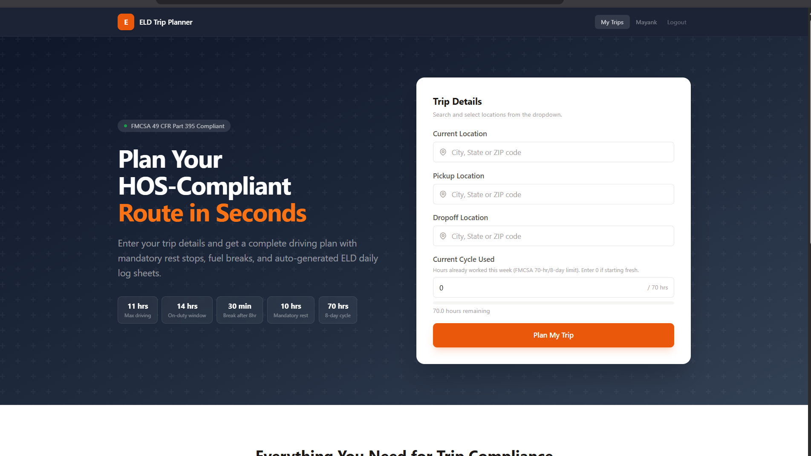
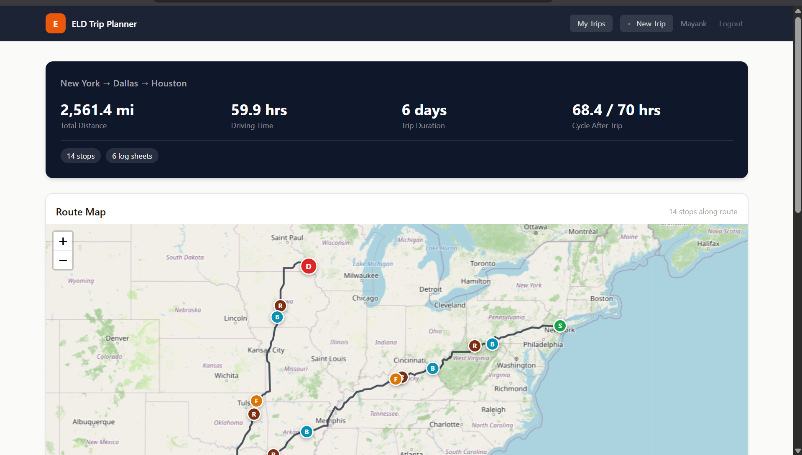
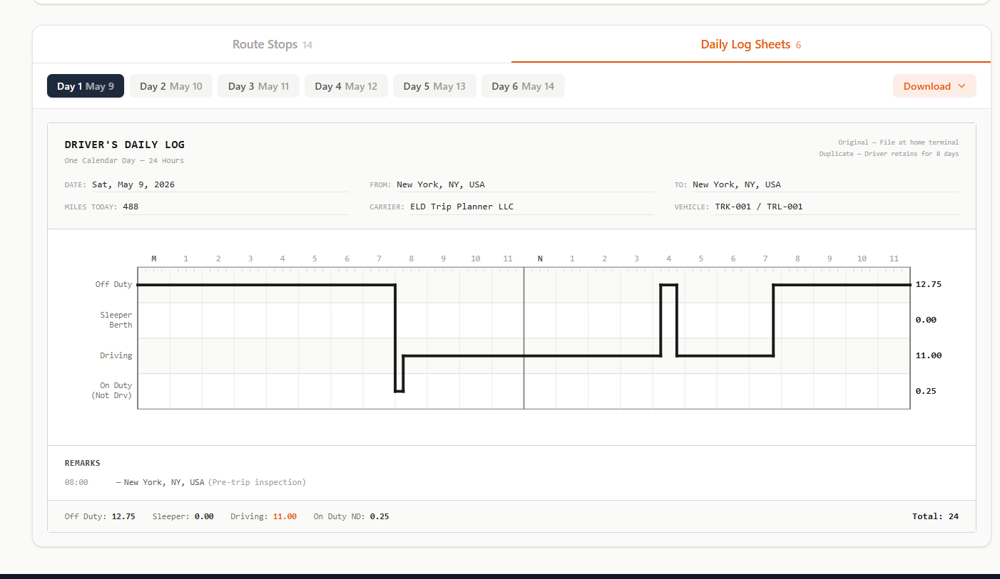
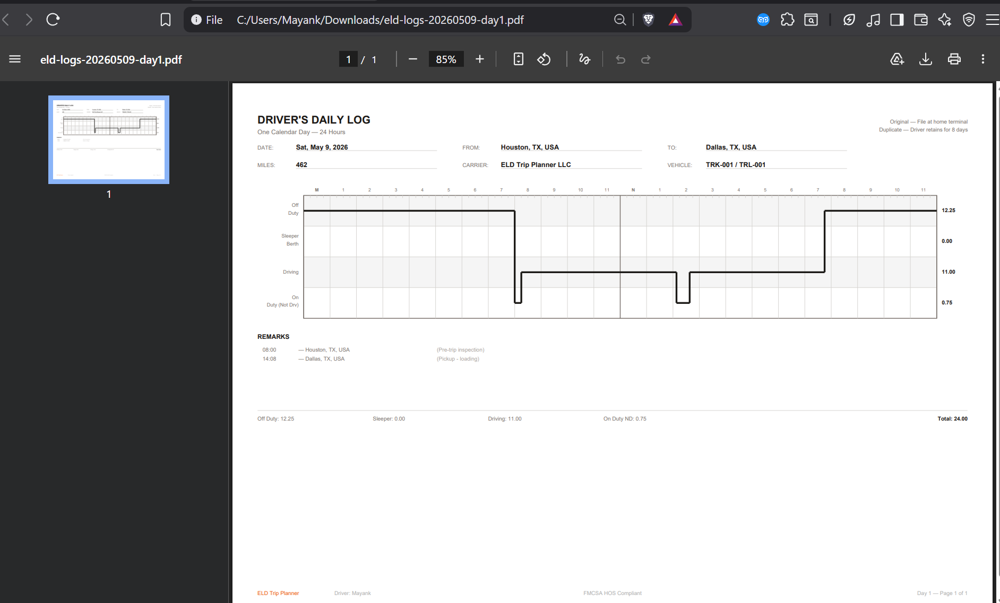

# ELD Trip Planner

A full-stack trip planning app for truck drivers that generates HOS-compliant routes and FMCSA daily log sheets.

**Live:** https://eld.mayank06711.xyz



## What it does

- Takes current location, pickup, dropoff, and cycle hours as input
- Calculates driving route using OpenRouteService (truck profile)
- Enforces FMCSA HOS rules: 11-hr driving, 14-hr window, 30-min breaks, 10-hr rest, 70-hr/8-day cycle
- Inserts fuel stops every 1,000 miles
- Generates daily log sheets with 24-hour duty status grids







## Tech Stack

- **Backend:** Django, Django REST Framework, JWT auth
- **Frontend:** React, Vite, Tailwind CSS, Leaflet, jsPDF
- **Deployment:** Docker, EC2, Caddy (auto SSL)

## Running Locally

### Prerequisites
- Docker and Docker Compose

### Setup

```bash
git clone https://github.com/Mayank06711/eld-trip-planner.git
cd eld-trip-planner
```

Create `backend/.env`:
```
DJANGO_SECRET_KEY=your-secret-key
DEBUG=True
ALLOWED_HOSTS=localhost,127.0.0.1
ORS_API_KEY=your-openrouteservice-api-key
```

Get a free ORS API key at https://openrouteservice.org/dev/#/signup

### Run

```bash
docker compose up --build
```

Open http://localhost (frontend on port 80, API proxied through nginx).

### Without Docker

**Backend:**
```bash
cd backend
python -m venv venv
source venv/bin/activate  # or venv\Scripts\activate on Windows
pip install -r requirements.txt
python manage.py migrate
python manage.py runserver 8000
```

**Frontend:**
```bash
cd frontend
npm install
npm run dev
```

Open http://localhost:5173

## API Endpoints

| Method | Endpoint | Auth | Description |
|--------|----------|------|-------------|
| GET | `/api/health/` | No | Health check |
| GET | `/api/geocode/?q=` | No | Location autocomplete |
| POST | `/api/trip/plan/` | No | Plan a trip |
| POST | `/api/auth/register/` | No | Create account |
| POST | `/api/auth/login/` | No | Get JWT tokens |
| GET | `/api/auth/me/` | Yes | Current user |
| POST | `/api/trips/save/` | Yes | Save a trip |
| GET | `/api/trips/` | Yes | List saved trips |
| GET | `/api/trips/:id/` | Yes | Get saved trip |
| DELETE | `/api/trips/:id/delete/` | Yes | Delete trip |
